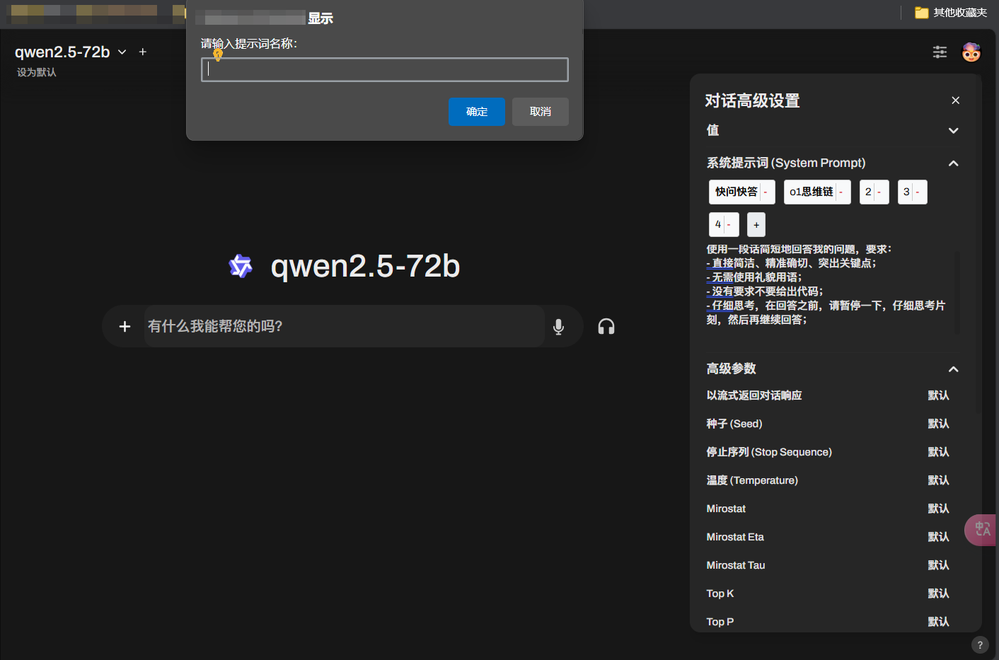

# OpenWebUI 提示词助手

✨ 一个为 OpenWebUI 添加类似于 nextchat 的面具、chatbox 的搭档功能的油猴脚本，可以快速填充对话高级设置中的系统提示词。

## 安装说明

1. 前往 [greasyfork](https://greasyfork.org)安装
2. 请手动修改脚本的`// @match {URL}`处为你的 OpenWebUI 的域名，例如`// @match https://127.0.0.1:8080/*`
